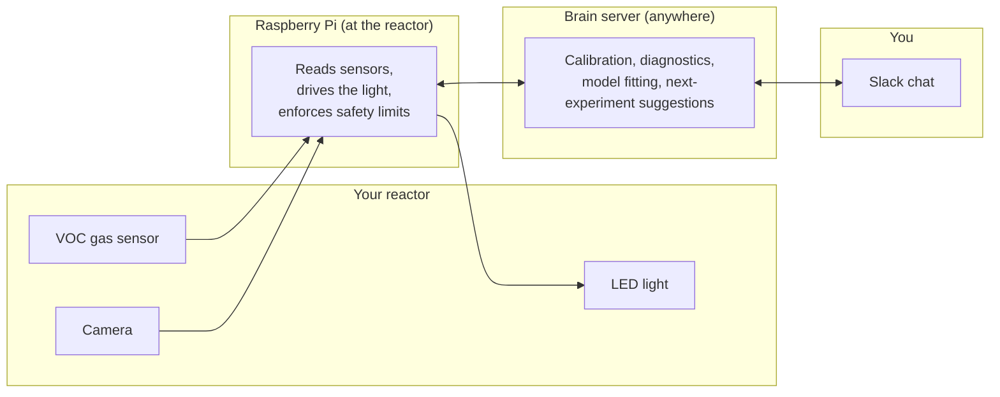

# AlgaeSense

AlgaeSense is a monitoring and control system for a small algae (*Arthrospira*/*Spirulina platensis*) cultivation reactor. It continuously watches the culture, can adjust its light, and lets you ask a conversational assistant (in Slack) to analyze results and suggest what experiment to try next — with a human approval step before anything actually touches the hardware.

This document explains what the system does and how to use it, aimed at a researcher who wants to *run experiments with it*, not necessarily read the code. If you're looking for developer-level detail instead, see [`CLAUDE.md`](CLAUDE.md).

## What it actually does

Picture your reactor jar sitting in its growth chamber. Three things watch it, one thing controls it, and an assistant sits on top making sense of the results.

- **A gas sensor** sits above the culture and continuously measures the volatile organic compounds (VOCs) the algae give off — a rough electronic "nose" that reports a reading roughly once per second.
- **A small camera** looks at the culture and estimates biomass from how green it is, on a slower schedule (once an hour by default).
- **An LED light** is the one thing the system can actually change. It can hold a constant brightness, or run a schedule — ramp up over time, oscillate, or step through a sequence of levels.
- **A safety check** re-verifies every single light command against your reactor's configured safe range, every time it's about to change — not just once when a schedule starts, but continuously for as long as it runs. If a computed value would ever be unsafe, the light schedule stops itself and turns the light off, rather than pushing through a bad value.
- **A symbolic-regression engine** (built on the [`jaxsr`](https://github.com/jkitchin/jaxsr) package) looks for the actual equation relating light to VOC output from your collected data, and can suggest which experiment to try next to learn the most.
- **A calibration wizard** walks you step-by-step through calibrating the gas sensor against a known reference gas, so raw sensor voltage can be converted into real ppm concentrations.
- **A conversational assistant**, reachable through Slack, ties all of the above together: ask it for a plot, ask what to try next, or ask it to change the light. It can only *propose* a hardware change and describe what it would do — a separate, explicit approval step is always required before anything reaches the physical LED.

### An important caveat about light readings

The system reports light levels in PAR (µmol·m⁻²·s⁻¹, the standard unit for photosynthetically active light), but without a dedicated PAR/quantum meter, that number is currently derived from a phone lux-meter reading and an approximate conversion factor — not a precision instrument measurement. Every PAR value in this system (live setpoints, logged schedules, anything a discovered equation reports) carries that approximation's uncertainty. Treat a discovered equation's light-related coefficients as directionally informative, not as exact physical constants, until a real PAR meter is used to calibrate this.

## How the pieces fit together



- The **Raspberry Pi** sits physically next to the reactor. It's the only part of the system that talks to real electronics — the gas sensor, the camera, and the LED strip.
- The **brain server** can run anywhere with network access to the Pi (it never needs to be physically nearby). It does the actual math: calibration, health diagnostics, model fitting, and experiment suggestions.
- **You** interact with the whole system through Slack. Behind the scenes, your messages go to a conversational agent that calls into the brain server's tools — and, for anything that would touch the reactor's light, those tools only ever *propose* a change; you approve it before it's applied.

## How the code works

You don't need to read any code to use AlgaeSense, but if you're curious what's actually happening behind each of the pieces above, here's the sequence of events, step by step.

### 1. Once a second, on the Raspberry Pi: read the sensor, run the light

The Pi runs one background loop, forever, once it's started ([`cli.py`](packages/algaesense-edge/src/algaesense_edge/cli.py)). Every tick of that loop does three things in order:

1. **Read the gas sensor** and write one row of data (`AcquisitionService.run_voc_tick`, in [`service.py`](packages/algaesense-edge/src/algaesense_edge/service.py)).
2. **Read the camera**, but only every hour or so, not every tick — biomass doesn't change fast enough to need per-second photos (`run_camera_tick`, same file).
3. **Check whether a light schedule is running**, and if so, ask a small piece of pure math ([`control_profiles.py`](packages/algaesense-edge/src/algaesense_edge/actuators/control_profiles.py)) what brightness the schedule calls for *right now*, then hand that number to the LED.

Every reading gets written to a Parquet file (a compact data-table format), organized by hour, so a full day's data isn't one giant unwieldy file and a crash mid-write can't corrupt what was already saved ([`writer.py`](packages/algaesense-edge/src/algaesense_edge/acquisition/writer.py)).

### 2. The light never gets an unchecked command

Whatever number the schedule computes — or whatever number you asked for directly — always passes through one more gate before it reaches the physical strip: `LEDActuator.set_par()` in [`actuators.py`](packages/algaesense-edge/src/algaesense_edge/actuators/actuators.py). It rejects anything negative, not-a-number, or above your reactor's configured maximum, *before* converting the request into an actual duty-cycle signal. This check runs on every single tick a schedule is active, not just once at the start — so a schedule can't "drift" into an unsafe request partway through and have it slip past. If a request ever fails this check, the light schedule stops itself and the light turns off, rather than continuing on a partially-broken schedule.

### 3. Turning raw voltage into real chemistry

A gas sensor doesn't report "ppm of VOCs" directly — it reports a raw voltage. The [`jaxsr-calibration`](packages/jaxsr-calibration) package is what turns that voltage into something meaningful:

- The **calibration wizard** (walked through in Slack) records voltage readings against known reference-gas concentrations, and fits a straight line between them (`fit_sensitivity_per_sensor`, in [`standard_addition.py`](packages/jaxsr-calibration/src/jaxsr_calibration/calibration/standard_addition.py)). That fit gets saved to disk once, and reused from then on.
- From then on, any raw voltage reading can be converted back into a real ppm value using that saved fit (`apply_calibration`, in [`apply.py`](packages/jaxsr-calibration/src/jaxsr_calibration/calibration/apply.py)).
- **Diagnostics** (fleet-zero, ambient-baseline, swap-pilot checks) run the same kind of statistics over a batch of readings to flag a sensor that's drifted or gone bad, before it quietly poisons a whole experiment's data.
- **Model fitting** takes a whole campaign's worth of calibrated readings and hands them to the upstream `jaxsr` symbolic-regression library, which searches for the actual equation relating your experimental conditions (like light level) to VOC output — rather than just fitting a generic curve.

### 4. How a Slack message actually reaches (or doesn't reach) the hardware

When you ask the assistant to do something, here's what happens depending on what you asked for:

- **"Plot my data" / "fit a model" / "run a diagnostic"** — these never touch the Pi or any hardware at all. They run entirely on the brain server, reading Parquet files that are already sitting on disk.
- **"Change the light" / "start a schedule"** — these are split into two separate steps in the code on purpose. A `propose_*` tool just builds a plain description of the change and returns it to you — no side effect at all. Only once you approve does an `apply_*` tool run, and that's the *only* code in the entire brain-server package that ever makes a network call to the Pi (`EdgeClient`, in [`edge_client.py`](packages/algaesense-agent/src/algaesense_agent/mcp_actuators/edge_client.py)). That call reaches the Pi's small web API ([`app.py`](packages/algaesense-edge/src/algaesense_edge/api/app.py)), which is what finally hands the request to the safety-checked `LEDActuator` from step 2.

The reason for splitting propose and apply into two separate code paths (rather than one function with a "confirm?" prompt inside it) is that it makes the boundary between "just talk about it" and "actually do it" a structural fact about the code, not just a runtime prompt that could be skipped or misfired.

## Getting started

1. **Source the hardware.** See [`hardware/BOM.md`](hardware/BOM.md) for the full parts list and wiring summary — Raspberry Pi 4, the VOC sensor and ADC, the LED strip and its level shifter, and the camera. Physical CAD files (mounts/enclosures) live in [`hardware/cad/`](hardware/cad/).
2. **Set up the Raspberry Pi and wiring.** Follow [`docs/hardware_setup.md`](docs/hardware_setup.md) for SSH access, sensor/LED wiring, and Pi-specific OS setup (this covers real, confirmed gotchas — GPIO permissions, an audio/LED conflict, camera driver quirks — worth reading before your first real run).
3. **Set up Slack and the conversational agent.** Follow [`docs/slack_and_hermes_setup.md`](docs/slack_and_hermes_setup.md) to create the Slack app, install the agent, and connect it to your Anthropic API key.
4. **Install the software.** Each part of the system installs independently — [`requirements.txt`](requirements.txt) lists every third-party dependency by which machine needs it, but the packages themselves aren't on PyPI, so each still needs its own editable install:
   ```bash
   pip install -e packages/jaxsr-calibration
   pip install -e "packages/algaesense-edge[hardware]"   # on the Raspberry Pi only
   pip install -e "packages/algaesense-agent"             # on the brain server
   ```
   Add the `cloud` extra (`pip install -e "packages/jaxsr-calibration[cloud]"`) on any machine that will use the Firebase remote-storage backend — see [`docs/remote_storage_setup.md`](docs/remote_storage_setup.md); skip it if you're keeping raw data local or using the `local`-directory backend instead.
5. **Calibrate your gas sensor** using the guided calibration wizard (ask the assistant in Slack to start a standard-addition calibration) before trusting any ppm readings.
6. **Start an experiment** and begin watching readings — either through the assistant, or the live dashboard (`streamlit run packages/algaesense-agent/src/algaesense_agent/dashboard/streamlit_app.py`).

## The live dashboard, and browsing past experiments

The Streamlit dashboard has two views, switchable from its sidebar:

- **Live** — polls the reactor's `algaesense-edge` instance directly and plots readings as they arrive (VOC in seconds since the experiment started, camera biomass in hours since it started), with an experiment info header (reactor, sensor, camera, start time) above the charts.
- **Past experiment** — browses previously-recorded experiments from a small local SQLite archive (`algaesense_agent.dashboard.history_db`), not the live edge instance. Since a reactor's raw Parquet files start out on its Raspberry Pi, this archive needs to be populated from a copy of that data — either pulled from cloud/remote storage, or copied manually.

  By default, raw data stays only on the Pi (and gets copied by hand below). If the Pi/laptop are instead configured to offload data to a remote storage backend as it's collected (Firebase by default, or your own storage — see [`docs/remote_storage_setup.md`](docs/remote_storage_setup.md)), sync straight from there instead of `scp`:

  ```bash
  algaesense-dashboard-sync --data-dir ./data --db-path ./data/dashboard_history.db \
    --storage-backend firebase \
    --storage-firebase-credentials ./algaesense-firebase-key.json \
    --storage-firebase-bucket your-project-id.appspot.com
  ```

  Without a remote storage backend configured, copy an experiment's files off the Pi manually first:

  ```bash
  # Copy an experiment's raw data off the Pi (adjust the Pi address/path)
  scp -r pi@<pi-address>:~/algaesense/algaesense/data/raw/experiments/<experiment_id> ./data/raw/experiments/

  # Then (re-)index it into the dashboard's history database
  algaesense-dashboard-sync --data-dir ./data --db-path ./data/dashboard_history.db
  ```

  Either way, re-running `algaesense-dashboard-sync` (with or without `--experiment-id <id>` to limit it to one) is always safe — it replaces that experiment's rows in the archive rather than duplicating them, so it's fine to re-sync a still-running experiment's data periodically.

See [`docs/remote_storage_setup.md`](docs/remote_storage_setup.md) for the full picture: why this exists (a long-running experiment can genuinely fill up the Pi's SD card or a laptop's disk), how the pluggable storage backend works, setting up Firebase specifically, or pointing it at your own local device/NAS instead.

## Using it day to day

Once everything is running, most interaction happens in Slack. A few examples of what you can ask for:

- "Plot the last few hours of VOC readings for reactor R01."
- "Fit a model for this campaign and suggest the next experiment to run."
- "Run a fleet-zero check on all sensors." (a health diagnostic)
- "Start a ramp on the LED from 0 to 300 PAR over the next hour." — the assistant will describe exactly what this will do and wait for your go-ahead before starting it.
- "Discover the light-response dynamics for this experiment." — feeds the experiment's real VOC trajectory and the light's actual applied brightness into the symbolic-regression engine to find the underlying equation.

Anything that would change the physical reactor (adjusting or scheduling the light) always follows a **propose → approve → apply** pattern — you'll see a plain description of the change before it happens, and nothing is applied until you say so.

## Project layout

The system is split into three independently-installable pieces:

- **`packages/jaxsr-calibration`** — the hardware-free math: calibration, diagnostics, and the model-fitting pipeline. Runs anywhere.
- **`packages/algaesense-edge`** — the code that runs on the Raspberry Pi: reading sensors, driving the LED, and enforcing safety limits.
- **`packages/algaesense-agent`** — the tools the Slack assistant calls: fitting models, running diagnostics, the calibration wizard, and the propose/approve/apply hardware controls.
- **`hardware/`** — the bill of materials ([`BOM.md`](hardware/BOM.md)) and physical CAD files ([`cad/`](hardware/cad/)) for the reactor's electronics build.

## Status

All three packages are built and tested (see [`CLAUDE.md`](CLAUDE.md) for the full test suite breakdown and development history). Hardware-dependent code has been written against confirmed real specifications for the project's Raspberry Pi 4, gas sensor, camera, and LED strip, but a full on-hardware verification pass is still pending — see [`docs/hardware_setup.md`](docs/hardware_setup.md) for the known, documented risks to check before that first real run.

## Further reading

- [`hardware/BOM.md`](hardware/BOM.md) — bill of materials and wiring summary
- [`docs/hardware_setup.md`](docs/hardware_setup.md) — SSH access, wiring, and Pi-specific setup
- [`docs/slack_and_hermes_setup.md`](docs/slack_and_hermes_setup.md) — Slack app and conversational-agent setup
- [`CLAUDE.md`](CLAUDE.md) — full technical architecture, coding conventions, and development history, for anyone working on the code itself
